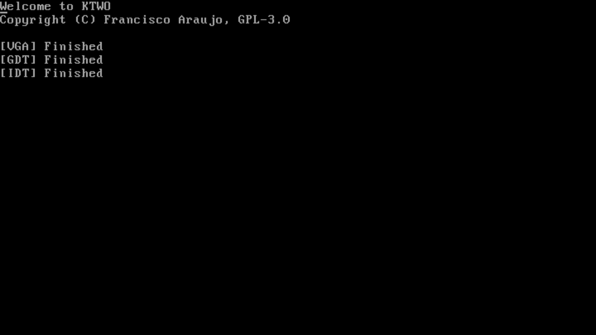

# ktwo kernel (32 bits)

This is a kernel I am developing as a hobby project. I have no plans to release it for general use; it’s simply an opportunity to fulfill my desire to create something of my own and explore the challenge of building a kernel from scratch.

  

## TODO List

### Bitness
- [ ]  8 bits
- [ ] 16 bits
- [X] 32 bits
- [ ] 64 bits

### Architecture
- [X] x86
- [ ] X86_64
- [ ] ARM
- [ ] RISC-V

### Boot and basic setup
- [X] Boot
- [X] GDT (Global Descriptor Table)
- [X] IDT (Interrupt Descriptor Table)

### Hardware Drivers
- [X] VGA
- [ ] Keyboard
- [ ] Mouse
- [ ] Disk
- [X] Pit

### Others
- [ ] Filesystem

## Build
Here is a guide on how to build ktwo plus the bootloader according to your operating system.

- [Windows](docs/setup/windows.md)
- [Linux](docs/setup/linux.md)

